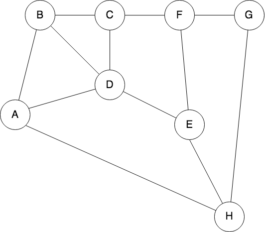

### MoovUp Graph Test (Question-1) 


### Requirement
* Java 17
* Maven

### Run Test
```
Open GraphPathTest.java
Then run test case you can and see the print output

OR
mvn test
You will see 
[INFO] Tests run: 2, Failures: 0, Errors: 0, Skipped: 0
```
### Question:
* a. Write a function that returns all the possible paths between A­-H.
* b. Write a function that returns the shortest path between A­-H.

