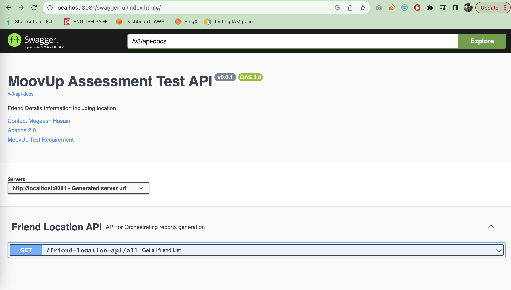

# Getting Started

### Application Requirement
* Java17
* Springboot 3.1.3
* Maven

### Local Setup Requirement
* use Java support any IDE
* open FriendsApiApplication.java and run
* http://localhost:8081/swagger-ui/index.html

### Run as a jar file
* git clone the project 
* cd  friendsApi
* mvn clean package
* java –jar target/FriendLocationApi-0.0.1-SNAPSHOT.jar
* then http://localhost:8081/swagger-ui/index.html
* production use production profile and configure token and client endpoint

### Other Reference Documentation

For further reference, please consider the following sections:

* [Official Apache Maven documentation](https://maven.apache.org/guides/index.html)
* [Spring Boot Maven Plugin Reference Guide](https://docs.spring.io/spring-boot/docs/3.1.3/maven-plugin/reference/html/)
* [Create an OCI image](https://docs.spring.io/spring-boot/docs/3.1.3/maven-plugin/reference/html/#build-image)
* [Spring Reactive Web](https://docs.spring.io/spring-boot/docs/3.1.3/reference/htmlsingle/index.html#web.reactive)

### Guides

The following guides illustrate how to use some features concretely:

* [Building a Reactive RESTful Web Service](https://spring.io/guides/gs/reactive-rest-service/)

