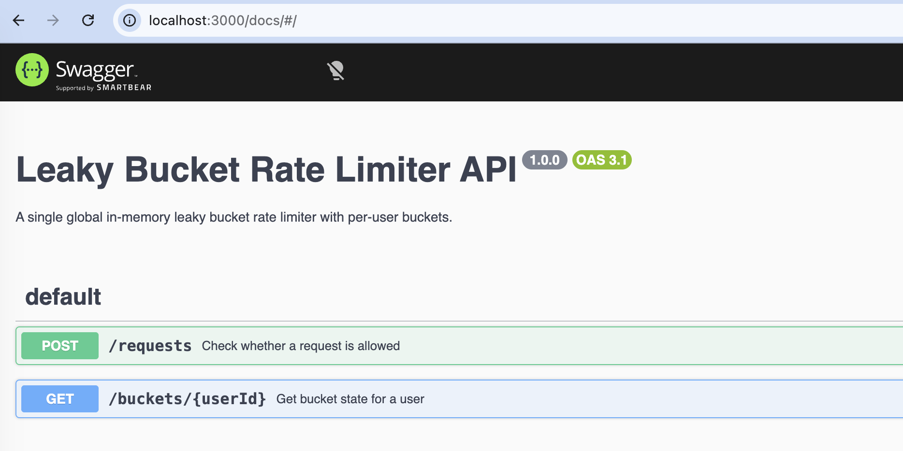

# Leaky Bucket Rate Limiter

A small REST API with one global in-memory leaky bucket limiter. Every user gets
their own bucket, and the core logic is written as pure functions.
## Requirements
Node.js 18 or newer, or Docker compose 

## Run the application with docker
```bash
docker compose up --build
```
That's all you need; the image installs its own dependencies. The same
environment variables work:
```bash
CAPACITY=10 LEAK_RATE=2 docker compose up --build
```
The app comes up on `http://localhost:3000`, and you can open the Swagger UI at
`http://localhost:3000/docs`.



## Run manually using npm 
```bash
npm install
npm start
```

Use this if you don't want Docker. The server runs on `http://localhost:3000`
either way.

Config comes from environment variables:

| Variable    | Default | Meaning                 |
|-------------|---------|-------------------------|
| `CAPACITY`  | `5`     | Maximum bucket size     |
| `LEAK_RATE` | `1.0`   | Units leaked per second |
| `PORT`      | `3000`  | HTTP port               |

```bash
CAPACITY=5 LEAK_RATE=1.0 PORT=3000 npm start
```

If you pass something that isn't a positive number, it throws at startup rather
than starting up broken.


## Tests

These run on the host, so they need `npm install` even if you're using Docker.

```bash
npm test
npm run typecheck
```
The typecheck script covers `src` and `tests`, since the build config only
includes `src`.

## API

Swagger UI is at `http://localhost:3000/docs`, and the raw OpenAPI spec at
`http://localhost:3000/openapi.json`.

### POST /requests

```bash
curl -X POST http://localhost:3000/requests \
  -H 'content-type: application/json' \
  -d '{"user_id":"user1"}'
```

You get `200` with `allowed: true`, or `429` with `allowed: false` if the request
would overflow the bucket.

```json
{ "allowed": true, "user_id": "user1", "bucket": { "level": 1, "lastTimestamp": 0 } }
```

Both responses carry `X-RateLimit-Limit` and `X-RateLimit-Remaining`. A `429` also
carries `Retry-After` with the whole seconds until there's room again, so the
client doesn't have to poll and guess.

### GET /buckets/:userId

```bash
curl http://localhost:3000/buckets/user1
```

Returns `200` with the bucket state, or `404` if that user has never made a request.

The level is leaked up to the moment you ask, using server time by default. If
you're driving the API with explicit timestamps, pass the same clock here or the
bucket will look empty:

```bash
curl 'http://localhost:3000/buckets/user1?timestamp=1'
```

## Core functions

All in `src/rateLimiter.ts`:

- `create_rate_limiter(capacity, leakRate)` throws if either value isn't a
  positive finite number
- `allow_request(limiter, userId, timestamp)` returns `[allowed, newLimiter]`
- `get_bucket_state(limiter, userId, timestamp?)` returns bucket info, or `null`
- `retry_after_seconds(limiter, userId, timestamp)` returns how long until one
  more request would fit

I added the last one so the Express handler doesn't have to do limiter arithmetic
itself.

## Notes on the design

The core is immutable: `allow_request` returns a new limiter, so the only mutation
in the app is one `let limiter` in `server.ts`. Buckets leak by `elapsed * leakRate`,
`lastTimestamp` only ever moves forward so a late timestamp can't make later
requests over-leak, and config is validated on boot. The trade-off is that the
bucket map gets copied on every request and drained buckets are never evicted, so
cost and memory both grow with the number of users.

## Layout

```
src/rateLimiter.ts                  the core functions
src/server.ts                       Express app
src/openapi.ts                      OpenAPI spec for Swagger UI
src/config.ts                       env config with validation
src/index.ts                        startup
tests/rateLimiter.test.ts           core unit tests
tests/rateLimiter.property.test.ts  property tests
tests/server.test.ts                API tests
```
